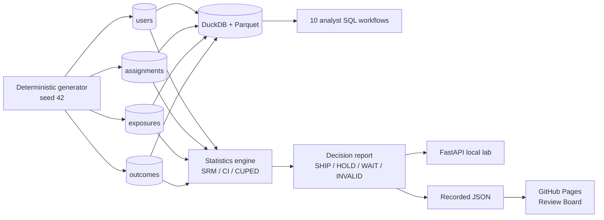

# Sports Experimentation Decision Lab

[](https://github.com/Boothill2001/sports-experimentation-decision-lab/actions/workflows/ci.yml)
[](https://boothill2001.github.io/sports-experimentation-decision-lab/)
[](https://www.python.org/)

A hands-on review board for deciding whether a sports-product experiment should
**SHIP, HOLD, WAIT, be declared INVALID, or remain INCONCLUSIVE**.

## [Open the public Experiment Review Board](https://boothill2001.github.io/sports-experimentation-decision-lab/)

No install, account, API key or cloud bill is required.

> All users, assignments, outcomes and effect sizes are deterministic synthetic data
> generated with seed `42`. This repository demonstrates experimentation method and
> decision quality, not Unity Sport, employer or client results.

## The design story

This is not another KPI dashboard. The interface is an executive review surface built
around the order in which a trustworthy experiment should be judged:

```text
Design -> Integrity -> Effect -> Guardrails -> Decision
```

- **Design** defines the business question, randomization unit, ITT population, primary
  metric, guardrails and sample before results are read.
- **Integrity** treats eligibility, assignment, exposure and outcome lineage as gates.
  SRM and exposure reconciliation are trust checkpoints, not decorative KPIs.
- **Effect** makes the 95% confidence interval the visual center of the evidence. The
  zero-effect line and uncertainty are readable before the p-value.
- **Guardrails** acts as a veto board and places durability and platform mix beside the
  primary effect so novelty and Simpson's paradox cannot hide.
- **Decision** converts evidence into a one-minute memo with rationale, limitation,
  owner and next action.

The **Practice mode** opens as a review drawer: choose a decision before revealing the
answer. The **Learning guide** is a separate guided overlay, keeping the recruiter view
focused on decision quality.

## Why this repository exists

Many portfolios stop at "treatment increased conversion and p < 0.05." Real product
analytics starts earlier and ends later:

1. Was randomization valid?
2. Which population and estimand are we measuring?
3. Is the effect precise and practically meaningful?
4. Did a safety guardrail regress?
5. Is the effect durable across time and planned segments?
6. What decision, owner and follow-up should Product take?

This lab makes those questions executable. It complements the dashboard,
analyst-workbench and live-reliability repositories in this portfolio without copying
their sidebar or KPI-card visual language.

## Recruiter-verifiable evidence

| Capability | Evidence |
|---|---|
| Experiment design | Randomization unit, ITT estimand, primary metric and predeclared guardrails |
| Statistical judgment | Absolute/relative lift, 95% CI, two-proportion test and practical significance |
| Trust gates | SRM, assignment/exposure reconciliation, crossover and data-quality checks |
| Decision quality | Guardrail veto, novelty detection, segment mix and honest limitations |
| Variance reduction | CUPED using pre-treatment watch behavior |
| SQL | Ten DuckDB workflows from lineage through cumulative snapshots |
| Communication | Eight Challenge/Reveal labs and a one-minute decision memo |
| Engineering | Deterministic generation, Parquet, DuckDB, tests, CI and public recorded demo |

## Six experiment traps

| Scenario | Observed temptation | Correct decision | Lesson |
|---|---|---|---|
| Clean win | Positive conversion lift | **SHIP** | Valid assignment + CI above zero + healthy guardrails |
| SRM | Lift looks attractive | **INVALID** | A p-value cannot repair broken randomization |
| Guardrail regression | Conversion rises | **HOLD** | Crash-rate harm can veto a primary win |
| Novelty effect | First week is strong | **WAIT** | Early excitement is not a durable effect |
| Simpson's paradox | Aggregate and platforms disagree | **INVALID** | Audit allocation mix before averaging |
| Exposure-selection bias | Exposed users look better | **INVALID** | ITT preserves randomization; exposure is post-treatment |

The matrix is calculated from generated rows, not hard-coded into the interface.
`sports-exp validate` rebuilds all six scenarios and verifies the public contract.

## Product architecture



### Data grain

| Table | Grain |
|---|---|
| `users` | One eligible synthetic user |
| `assignments` | One experiment assignment per user |
| `exposures` | One first recorded Match Center v2 exposure per exposed user |
| `outcomes` | One seven/30-day outcome row per assigned user |

Read the [metric contract](docs/METRIC_CONTRACT.md) before interpreting a result.

## Use it as a learning lab

Double-click `start_lab.bat`. It creates a Python 3.11 environment, regenerates the
recorded evidence and opens `http://localhost:8091`.

Review an experiment in this order:

1. Check the design contract.
2. Pass the integrity gates.
3. Interpret effect size and uncertainty.
4. Check vetoes, durability and segment mix.
5. Make and communicate the decision.

Start with the Vietnamese [7-day workbook](docs/HOC_7_NGAY.txt), then use the
[decision memo template](docs/DECISION_MEMO.txt) and practice the
[top 10 interview questions](docs/TOP10_CAU_HOI_PV.txt).

## Reproduce locally

```powershell
py -3.11 -m venv .venv
.\.venv\Scripts\Activate.ps1
pip install -e ".[dev]"

# Create Parquet and DuckDB tables
sports-exp generate --profile smoke --scenario clean

# Inspect a decision or practice a guided lab
sports-exp analyze --scenario guardrail
sports-exp run-lab L03

# Rebuild public evidence and validate every scenario
sports-exp export-pages
sports-exp validate
```

Profiles:

- `smoke`: 10,000 assigned users across 14 cohort days.
- `portfolio`: 100,000 assigned users across 28 cohort days.

## Ten SQL workflows

[The DuckDB workbook](sql/duckdb/experiment_workflows.sql) covers:

1. Assignment and exposure reconciliation.
2. Sample-ratio mismatch inputs.
3. Intent-to-treat subscription lift.
4. Crash and cancellation guardrails.
5. Early-versus-late novelty cohorts.
6. Simpson's paradox by platform.
7. Assigned versus exposed-only populations.
8. CUPED inputs and pre/post correlation.
9. Cumulative snapshots for peeking review.
10. Crossover and event-order quality checks.

## Quality gates

```powershell
ruff check .
sqlfluff lint sql/duckdb
pytest
sports-exp validate
```

Tests cover deterministic generation, primary/foreign keys, population preservation,
SRM, guardrail veto, novelty, Simpson's paradox, exposure bias, CUPED, DuckDB
persistence, UI contract, public export and API transparency. Coverage must remain at
least 85%.

On every `main` push, GitHub Actions rebuilds the JSON and fails if committed evidence
no longer matches the statistics engine. Pages deploys only after quality gates pass.

## 90-second interview walkthrough

1. Business question and randomization unit.
2. ITT population and primary metric.
3. SRM and lineage trust gates.
4. Absolute effect, confidence interval and p-value.
5. Guardrail veto.
6. Durability and planned platform segments.
7. SHIP/HOLD/WAIT/INVALID recommendation.
8. Owner, next action and synthetic-data limitation.

The strongest line in this repository is:

> "I check whether an experiment is interpretable before I check whether it is significant."

## Honest limitations

- Synthetic rows demonstrate known failure modes; they do not estimate a real product effect.
- The two-proportion test assumes independent user-level assignment.
- This release does not implement network interference, cluster randomization or Bayesian analysis.
- CUPED uses one pre-period covariate and does not replace a full power-analysis process.
- Platform breakdowns are planned diagnostics; arbitrary subgroup hunting would inflate false positives.
- Public Pages is recorded evidence, while local FastAPI regenerates the same seeded scenarios.

Released under the [MIT License](LICENSE).
